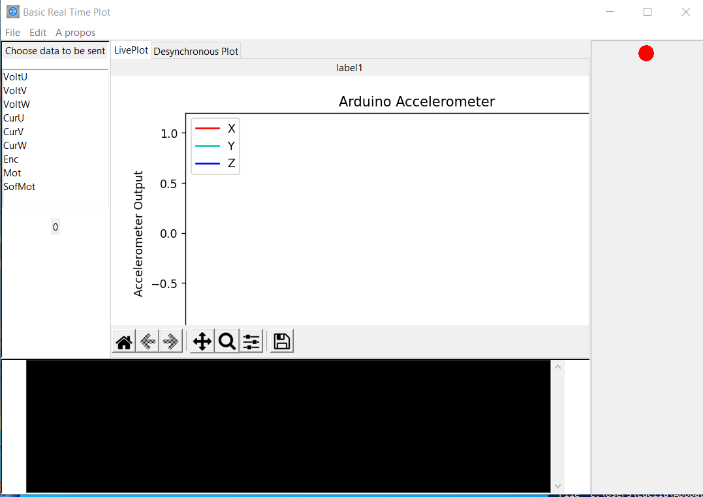

# USBPlotter

## Presentation:
This is a basic plot software that enables to connect to a ST32 board and plot in realtime up to 9 signals ( could be provided by ADCs or others)
  

## Getting Started:

0. Install the appropriate runtime environment

- Install a python environment (tested on python 3.9)

- Install Panda :
'pip install pandas'
- Install Tkinter :  
'pip install tk'

1. Plug in a STM32 F401 Board (Nucleo or discovery) with a the apprpriate [firmware](https://github.com/Luczia/NUC401-CubeMX-USB-CDC-FS)

2. Wait for the conection indicator to turn from red to green.
